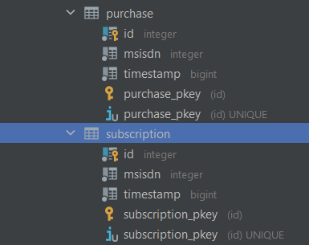

**REST / Spring Boot / JPA / PostgreSQL DB / Lombok / Mapstruct**
##
**TEST TASK**
##

**Description**
>It is necessary to implement a service consisting of 2 applications. First
the publisher application is responsible for generating and sending messages to the subscriber
(subscriber). Subscriber parses the message and writes it down according to certain logic
to the database.


**Описание**
>Необходимо реализовать сервис, состоящий из 2 приложений. Первое
приложение publisher отвечает за генерацию и отправку сообщений подписчику
(subscriber). Subscriber разбирает сообщение и по определенной логике записывает его
в базу данных.

**Technology stack:**
- Spring Boot
- REST
- Spring Data JPA
- PostgreSQL DB
- Maven
- JUnit
- Lombok
- Mapstruct

##
**How to use this program**

**1. Clone a repository:**

```sh
 git clone https://github.com/SanyaAntonov/publisher-subscriber-service.git
```

**2. Open the project using the IDE**

**3. Create database "subscriber" in your postgres :**
```sh
spring.datasource.url=jdbc:postgresql://localhost:5432/subscriber
spring.datasource.username=postgres
spring.datasource.password=postgres

```
**DB SCHEMA (spring.jpa.hibernate.ddl-auto=create-drop)**
##  ##

**4. Run this 2 services in your IDE**

**5. Start publisher-subscriber service :**
```sh
  GET http://localhost:8080/start
```
##
